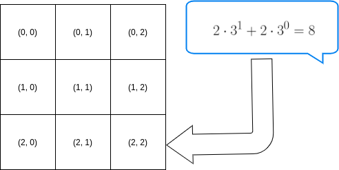

# LOF: Identifying Density-Based Local Outliers

This repository contains our improvements of the algorithm introduced in [[1]](#1). Following the course curriculum our efforts concentrated on restructuring, unrolling and vectorizing various elements of the computations. Furthermore we have experimented with different data structures and memory layouts.

This repository is structured as follows:

* folders `src` and `include` contain the function that we use in all subtasks, such as
    * `lof_baseline.c`: first naive implementation of most of the computations 
    * `Algorithm.c`: functions that we have used to combine different parts of the computations together to verify and measure the overall performance
    * `final_plots.c`: plot / compare the overall performance (runtime) of different pipelines
* folders `unrolled`, `avx` and `memory` contain the improvements of different parts of compuations. The files therein tend to have the same names as functions from `lof_baseline.c`
* `python_scripts`
    * `generator.py`: wrapper around the `sklearn.neighbors.LocalOutlierFactor` that we have used as our benchmark
    * `performance_plots.ipynb`: functions to produce performance plots and the roofline plot

## Function Names:

The figure below, demonstrates various approaches we have used to divide the computations into smaller parts. 

The folder `src` contains the naive implementations of all subroutines. The modified version can be found in `unrollded`, `avx` and `memory` under a similar name.

* **(F1)**: `lof_baseline.c` => `ComputePairwiseDistances`
* **(F2)**: `lof_baseline.c` => `ComputeKDistanceAll`
* **(F3)**: `lof_baseline.c` => `ComputeKDistanceNeighborhoodAll`
* **(F4)**: `lof_baseline.c` => `ComputeReachabilityDistanceAll`
* **(F5)**: `lof_baseline.c` => `ComputeLocalReachabilityDensity`
* **(F6)**: `lof_baseline.c` => `ComputeLocalOutlierFactor`

To reduce the computation overhead we have combined **(F4)** and **(F5)** into a function `lof_baseline.c` => `ComputeLocalReachabilityDensityMerged`

To optimize the memory access pattern, we have changed the interface of **(F6)** and **(F4) + (F5)**, see implementation in 
* `lof_baseline.c` => `ComputeLocalReachabilityDensityMerged_Pipeline2`
* `lof_baseline.c` => `ComputeLocalOutlierFactor_Pipeline2`

### Pairwise distance calculation using MMM

Replaces the naive pairwise distances calculation with a more efficient and fast alternative: ComputePairwiseDistancesMMM which uses the MMM "kernel". 

* `ComputePairwiseDistancesMMMUnroll.c` => `ComputePairwiseDistancesMMM_baseline` and `ComputePairwiseDistancesMMMUnroll_fastest` along with other intermediate versions.
* `ComputePairwiseDistancesMMMAvx.c` => `ComputePairwiseDistancesMMMAvx_fastest` along with other intermediate versions.

The MMM kernels can be found in `MMMAvx.c` and `MMM.c` files.

### Merging F2 and F3 in KNN 

Attempt to replace the two different functions with a single pass computation of both the neighbors and their distances. Functions can be found in the following files

* `KNN.c` => `KNN_fastest` along with other versions. Eventually proved to be less efficient than expected.
## Topology based representations
The major weak point of the method is the necessity of computing a k-neighborhood. A bruteforce search based on searching 
the neighbors given their distance is not feasible for a larger number of points.

The proposed solution was using a multidimensional index, based on the spread range of the points given certain dimensions. 
The representation of the bins produced by the division of the space is tree-based, with the number of leaves given by the resolution used.

The searching in the tree is boosted by hashing the cells using basis representations. 

 

The implementation can be found under the `src/lattice.c`, `avx/performance_improvement/AVX_lattice.c`, `src/ComputeTopologyInfo.c`, 
`avx/performance_improvement/AVXTopoInfo.c`.
## Final algorithm versions

* Baseline variant implemented in the `algorithm_driver_baseline` function.
* Baseline pairwise distance calculation with knn and optimized memory access pattern in `algorithm_driver_knn_memory_struct`.
* MMM pairwise distance calculation with knn and optimized memory access pattern in `algorithm_driver_knn_blocked_mmm`.
* MMM pairwise distance calculation with baseline downstream in `razvan_pipeline` in a different branch. Update!!
* Algorithm implemented using the lattice heuristic `algorithm_driver_lattice`.

## References
<a id="1">[1]</a> 
Breunig, Markus M., et al. (2000) 
LOF: identifying density-based local outliers. 
Proceedings of the 2000 ACM SIGMOD international conference on Management of data. 
